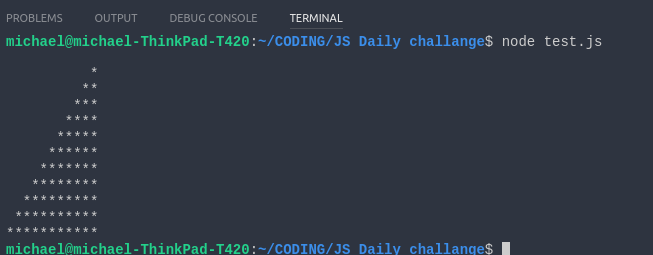
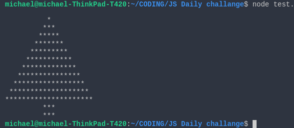

## Day 1 JS Challenge

This challenge is in three parts. Create a file called `Day1.js` in which you will implement your solution 
and then run it the usual way in Node.js `node Day1.js`.

### Part One

Create a program that when run will give the following output in the console:

### Part Two

Create a program that when run will give the following output in the console:

### Part Three

Ho ho ho! Is that Santa coming? Help Santa and get him a proper Xmas tree!

### Good luck folks!

